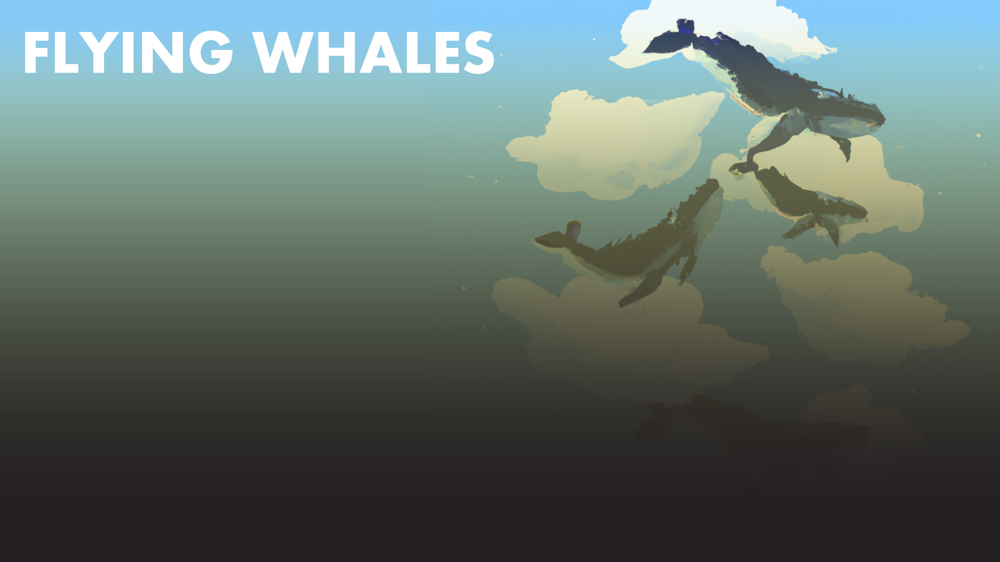
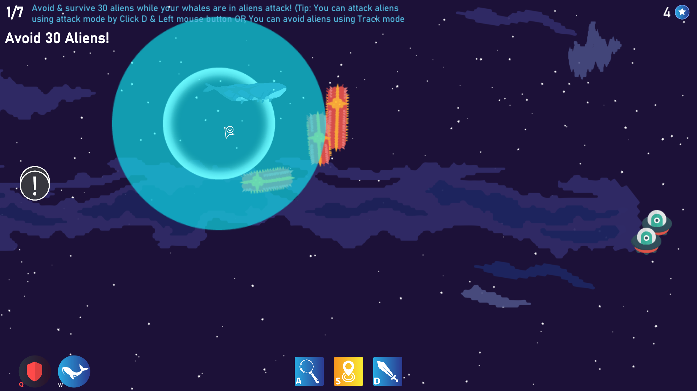
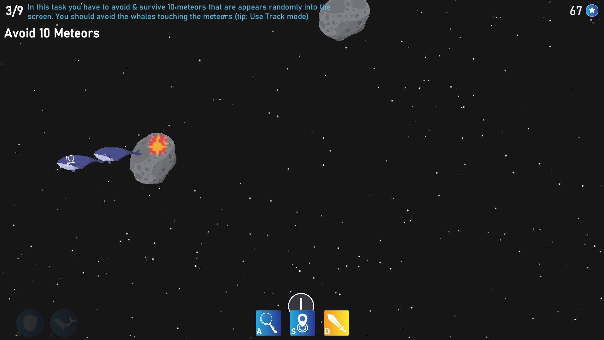
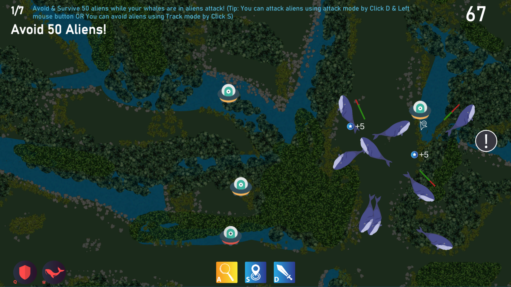

# Flying Whales

> The concept is to make a single-player game of protecting the flying whales in the night sky from meteors, aliens and other harmful, the main goal is to help the whales to save their planet.

## Links

- Play the game [Online](https://shoot-for-the-sky.itch.io/flying-whales)

- See the [Official Trailer](https://www.youtube.com/watch?v=Jfe2Gn9S7oQ)

- See `2.5.0 beta version` [Intro Level GamePlay](https://www.youtube.com/watch?v=Ix6UJmYa_jI)

- See `2.5.0 beta version` [Sky level GamePlay](https://youtu.be/H_6G8MWQZ3E)

- See the [Formal Elements](formal-elements.md)

- See the [Dramatic Elements](dramatic-elements.md)

- See the [Dynamic Elements](dynamic.md)

- Explore the game's lore through a text based game built-in twine [The Story of the Flying Whales](https://shoot-for-the-sky.github.io/flying-whales/The_story_of_the_flying_whales.html)

## Game Controls

The controls for the game are:

A - Dynamic mode. In this mode the whales will randomly gather points, and slowly regenerate lost health point. This mode is high risk high reward- the more you spend time in this mode the more points you will have, but you have to be quicker in reacting to incoming danger.

S - Track mode. In this mode the whales are commanded to follow your cursor. Use this mode to reposition the whales and to avoid danger.

D- Attack mode. In this mode the whales are stationary until you press left click with your mouse, thats when they will dash to that location. Each whale you have deals damage individually, so when your pack grows larger not only its easier to survive but you also deal more damage.  

Tip- When attacking enemies don't aim at them, aim behind them, That way when the dash is complete the whales are further away from the danger.

Shield and Whale summon skills when available:

Q- Shield, When off cooldown you can press Q to summon an invincible shield for a few seconds. The shield also deals damage to enemies! Decide for yourself whether you prefer to use it as an attacking tool or as a defensive tool.

W- Whale summon. The whales call for help and summon an additional whale. Use this whenever possible! The more whales you have the stronger you are.

## Gameplay Screenshot

### Sky

### Space

### Forest

## [1.0.0 Patch](https://github.com/flying-whales/flying-whales/releases/tag/1.0.0)

- Add world background prefab
- Add basic whales
- Add Missiles

## [1.6.1 Patch](https://github.com/flying-whales/flying-whales/releases/tag/1.6.1)

- Add whale state system
- Add basic ui in game showing whales states
- Add whales movement animation
- Improve whales controlling and behaviours
- Add checklist state system
- Add basic ui in game showing checklist
- Add main menu scene
- Add util functions scripts

## [2.6.3 Patch](https://github.com/flying-whales/flying-whales/releases/tag/2.6.3)

- Improve checklist system
- Improve enemy movement
- Add loot system
- Add damage for player and enemies
- Fix dynamic state behaviour
- Add powers (shield & call)
- Done intro level
- Improve background
- Improve in-game UI

## [2.4.1 Patch](https://github.com/flying-whales/flying-whales/releases/tag/2.4.1)

- Create function timer utils
- Add whale life bar
- Implement all scenario levels
- Create alien enemies
- Improve in-game UI
- Add end game screen
- Add pause game screen
- Fix event system
- Fix main menu lock scenario screen
- Add high score of scenario feature
- Improve balance of whale powers

## [2.4.9 Patch](https://github.com/flying-whales/flying-whales/releases/tag/2.4.9)

- Add process manager
- Fix UI bugs
- Fix cursor bugs
- Add main sounds
- Improve balance of enemies damage and health point
- Improve balance of whale powers

## [2.5.0 Patch](https://github.com/flying-whales/flying-whales/releases/tag/2.5.0)

- Fix OpenGL text problem
- Fix audio manager
- Fix UI bugs

## [2.5.2 Patch](https://github.com/flying-whales/flying-whales/releases/tag/2.5.2)

- UI resolution fix

## [2.5.4 Patch](https://github.com/flying-whales/flying-whales/releases/tag/2.5.4)

* Fix scenario's control
* Fix forest level
* Add heal feature in dynamic mode

## [2.5.5 Patch](https://github.com/flying-whales/flying-whales/releases/tag/2.5.5)

* Fix score icon
* Fix audio loop
* Improve explosions
* Order project files
